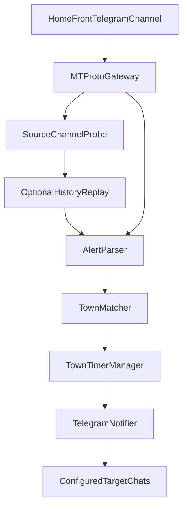

# Architecture

## Purpose

`when-to-exit` listens to Home Front Command Telegram alerts, tracks monitored
towns/cities, and sends a private "safe to leave the safe room" message after a
quiet period (default: 10 minutes) per town.

## High-Level Flow



1. App resolves and verifies access to the configured source channel.
2. Optional startup replay fetches historical messages for a lookback window.
3. Live and historical messages go through the same parse/match pipeline.
4. For each matched monitored town, timer manager schedules by **alert timestamp**.
5. On expiry, notifier sends "safe to leave" to all configured target chats, including link to last alert.

## Modules

### `src/index.js` (Orchestration)

- Loads configuration.
- Creates Telegram gateway.
- Runs startup channel probe and optional history replay.
- Instantiates timer manager with expiration callback.
- Subscribes to source messages and drives parsing/matching/timer updates.
- Deduplicates by message id to avoid processing the same alert twice.

### `src/config.js` (Configuration + Validation)

Loads environment variables and validates required fields:

- `TELEGRAM_API_ID` (positive integer)
- `TELEGRAM_API_HASH`
- `SOURCE_CHANNEL`
- `TARGET_CHAT_IDS` (preferred, comma-separated) or `TARGET_CHAT_ID` (backward-compatible)
- `MONITORED_TOWNS` (comma-separated, at least one)
- `TIMER_MINUTES` (positive integer, default `10`)

Optional:

- `TELEGRAM_SESSION_STRING` (preferred for non-interactive startup)
- `TELEGRAM_PHONE` (used for first-time interactive login)
- `FETCH_PAST_ALERTS_ON_START` (`true|false`, default `false`)
- `PAST_ALERTS_MINUTES` (positive integer, default `TIMER_MINUTES`)

### `src/telegram.js` (Telegram Integration)

- Uses `telegram` (MTProto / GramJS) and `StringSession`.
- Starts client and performs interactive login when no session string exists.
- Normalizes and resolves source channel (`@username`, `t.me` link, or numeric id).
- Probes latest channel messages on startup for diagnostics.
- Exposes:
  - `onSourceMessage(handler)` for incoming channel messages
  - `sendText(message, targetChatId)` for outgoing notifications
  - `getRecentSourceMessages(minutes)` for startup replay
  - `buildSourceMessageLink(messageId)` for notification linking

### `src/parser.js` (Alert Parsing + Matching)

Responsibilities:

- Normalize Hebrew/Unicode dash variants and whitespace.
- Skip non-town lines (headers/instructions).
- Parse town list from lines in format:
  - `TownA, TownB (time to shelter)`
- Return unique extracted town names.
- Filter out alert headline artifacts like `🚨 ירי רקטות וטילים`.
- Match monitored towns using:
  - Exact match
  - Base-city match (`באר שבע` matches `באר שבע - דרום`, etc.)

### `src/timers.js` (Per-Town Quiet Window)

- Maintains an in-memory `Map` keyed by monitored town.
- `upsert(town, matchingAlertTowns, alertDate, metadata)`:
  - Clears existing timeout if present.
  - Ignores out-of-order older alerts (`SKIP_OLD`) to prevent stale resets.
  - Computes expiration from `alertDate + duration`.
  - Uses immediate expiry when alert window already passed.
- On timeout expiry:
  - Removes timer from map.
  - Calls async `onExpire(town, context)` callback (notification send).

## Data Model

### Runtime Config Object

```js
{
  telegramApiId: number,
  telegramApiHash: string,
  telegramSession: string,
  telegramPhone: string,
  sourceChannel: string,
  targetChatIds: string[],
  monitoredTowns: string[],
  timerMinutes: number,
  fetchPastAlertsOnStart: boolean,
  pastAlertsMinutes: number
}
```

### Matching Output

`matchConfiguredTowns()` returns:

- `alertTowns: string[]` extracted from current message.
- `matched: Map<string, string[]>`
  - Key: monitored town.
  - Value: matching extracted alert town names.

## Timer Semantics

- Independent timer per monitored town.
- Newer match for same monitored town resets timer based on the newer alert timestamp.
- Expiry is based on time since **last matching alert time** (not processing time).
- Alerts older than tracked alert for a town are ignored.
- Timers are process-memory only (lost on restart).

## Authentication Model

- First run: interactive Telegram login (phone/code/password).
- App prints reusable `TELEGRAM_SESSION_STRING`.
- Subsequent runs: session string avoids interactive prompts.

## Error Handling

- Startup validation errors fail fast (missing env / invalid values).
- Source-channel resolution errors fail fast with actionable error text.
- Telegram login and handler errors are surfaced through logger callbacks.
- Expiration callback failures are caught and logged per-town.
- Optional startup replay can fetch recent source messages and process them
  through the same parser/matcher/timer pipeline.

## Observability

Current logs include:

- `SOURCE` and channel probe details.
- `HISTORY` fetch/filter diagnostics.
- `RECEIVED` and `PARSE` message processing details.
- `MATCH` when a message matches monitored towns.
- `START` / `RESET` / `SKIP_OLD` for town timers.
- `EXPIRE_TRIGGER` when timeout callback runs.
- `EXPIRE` when safe notification is sent (or fails).
- `NOTIFY` send success/failure per target chat.

## Test Strategy

Core behavior is verified by tests in `test/`:

- Parser extraction and normalization.
- Matching logic, including base-city behavior.
- Timer start/reset/clear semantics, alert-time anchoring, and out-of-order protection.
- Config validation and parsing defaults.
- Telegram helper logic (source normalization, date normalization, link building).

Integration with live Telegram APIs is intentionally not in unit tests and is
validated in manual end-to-end runs.
